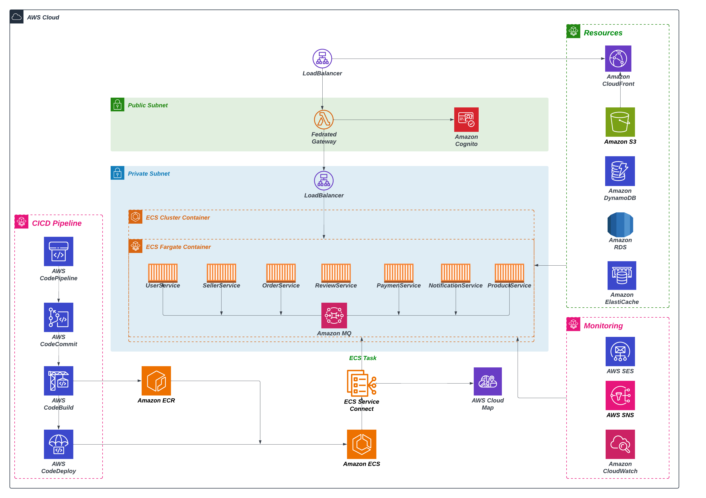
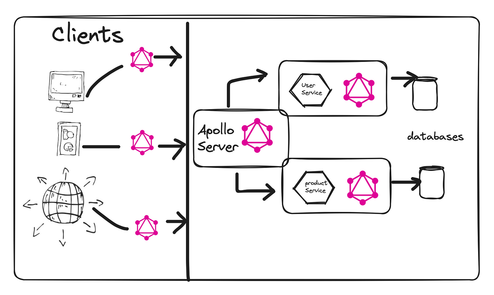

# **Microservices-based E-Commerce Application**

  

---

## **Overview**

This project is a microservices-based e-commerce platform designed for scalability, modularity, and security. It leverages **Apollo Federated GraphQL** for a unified API layer and is deployed on AWS using scalable and resilient cloud services.

---

## **Key Components**

### **1. Federated Gateway with Apollo GraphQL**

  

- **Federated Gateway**: Combines GraphQL schemas from all microservices into a unified API.
- **Advantages**:
  - Enables independent service development and scalability.
  - Simplifies API management with schema stitching.
  - Reduces client-side integration complexity.

---

### **2. CICD Pipeline**

The CI/CD pipeline automates application delivery using AWS:
- **CodeCommit**: Version control for source code.
- **CodeBuild**: Builds and packages deployable artifacts.
- **CodePipeline**: Manages build, test, and deployment workflows.
- **CodeDeploy**: Automates container deployments to Amazon ECS.

---

### **3. Microservices Deployment**

Each service is deployed as a containerized task using **Amazon ECS Fargate**, enabling:
- Independent scaling.
- Fault isolation.
- Efficient resource management.

Services include:
- **UserService**, **SellerService**, **OrderService**, **ProductService**, etc.

---

### **4. Secure Networking**

- **Public Subnet**: Hosts Load Balancers and resources requiring internet access.
- **Private Subnet**: Secures backend services and database resources.

Traffic to the private subnet is routed through the Load Balancer for enhanced security.

---

### **5. Persistent Storage**

- **Amazon S3**: Stores static assets such as product images.
- **Amazon DynamoDB**: Handles high-speed NoSQL data.
- **Amazon RDS**: Manages relational data for transactions.
- **Amazon ElastiCache**: Caches frequent queries for faster responses.

---

### **6. Monitoring and Notifications**

- **Amazon CloudWatch**: Tracks metrics and logs for system performance.
- **AWS SNS**: Sends notifications for events and alerts.
- **AWS SES**: Handles email-based communication.

---

## **Key Features**
- **Federated GraphQL Gateway**: A centralized API layer connecting all microservices.
- **CI/CD Automation**: Simplified deployment with AWS CodePipeline and CodeDeploy.
- **Containerized Microservices**: Serverless scalability with Amazon ECS Fargate.
- **Resilient Messaging**: Asynchronous communication via Amazon MQ.
- **Global Content Delivery**: Low-latency distribution with Amazon CloudFront.

---

## **Getting Started**

1. Clone the repository using **AWS CodeCommit**.
2. Trigger the build pipeline with **AWS CodePipeline**.
3. Deploy the application to Amazon ECS via **CodeDeploy**.
4. Access the application using the public Load Balancer endpoint.

---

## **License**
This project is licensed under the [MIT License](LICENSE).

---

Thanks for Reading it out 😎